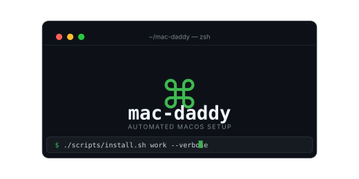

<p align="center">
  
</p>

# mac-daddy

Automated macOS setup — from a blank Mac to a fully configured personal environment in one command.

## Prerequisites

- macOS 13 (Ventura) or later
- Internet connection
- Xcode Command Line Tools (the install script will prompt if missing)

## Quick Start

**Option 1: Clone and run (recommended)**
```bash
git clone https://github.com/HauptSec/mac-daddy
cd mac-daddy
./scripts/install.sh
```

**Option 2: One-liner** (clones the repo to `~/.mac-daddy/repo` then runs)
```bash
curl -fsSL https://raw.githubusercontent.com/HauptSec/mac-daddy/main/scripts/install.sh | bash
```

The script will prompt you to choose a profile if you don't specify one.

## Profiles

| Profile | Who it's for | Extra apps |
|---------|-------------|------------|
| **work** | Work / development machine | ChatGPT, Citrix Workspace, PingID, Postman, Slack, Zoom |
| **personal** | Personal machine | Discord, Obsidian, Spotify |

Both profiles share a common base: Claude, Claude Code, iTerm2, Maccy, Python, VS Code, Vivaldi, Oh My Zsh + Powerlevel10k, and the full macOS defaults setup.

## Available Flags

```bash
./scripts/install.sh [work|personal] [flags]
```

| Flag | Effect |
|------|--------|
| `--dry-run` | Print every action without executing anything |
| `--verbose` | Log each command before running it |
| `--skip-macos-defaults` | Skip `defaults write` changes and Touch ID for sudo setup |

Flags can be combined and appear in any order:
```bash
./scripts/install.sh work --dry-run --verbose
./scripts/install.sh personal --skip-macos-defaults
```

## What Gets Configured

**Shell**
- Oh My Zsh with Powerlevel10k theme (rainbow, 2-line prompt)
- Plugins: `git`, `autojump`, `sudo`, `vscode`, `zsh-autosuggestions`, `zsh-syntax-highlighting`, `z`, `fzf`
- History sharing across sessions, deduplication, ignore-space
- Modern aliases: `eza` for `ls`, `bat` for `cat`, `zoxide` for `cd` (when installed)

**Security**
- Touch ID for `sudo` via `/etc/pam.d/sudo_local` (Sonoma+ compatible)
- `pam-reattach` so Touch ID works inside tmux

**macOS System Preferences**
- Comprehensive `defaults write` settings (Dock, Finder, keyboard, trackpad, screenshots, etc.)
- Profile-specific overrides applied after shared defaults

## How to Customize

After cloning, edit these to make it yours:

1. **`profiles/shared/dotfiles/.gitconfig`** — replace the TODO name/email with yours
2. **`profiles/shared/dotfiles/.p10k.zsh`** — your Powerlevel10k prompt config (run `p10k configure` to regenerate)
3. **`profiles/shared/apps/brew-formulae.txt`** — your CLI tools
4. **`profiles/shared/apps/brew-casks.txt`** — your GUI apps
5. **`profiles/shared/macos/defaults.sh`** — tweak any system preference values
6. **`profiles/{work,personal}/apps/brew-casks.txt`** — profile-specific apps

## How to Update an Existing Machine

Re-run the install script — the smart diff skips everything already installed:

```bash
cd ~/.mac-daddy/repo
git pull
./scripts/install.sh work
```

Only new items (added since your last run) will be installed. Dotfiles are always live-synced via symlinks so they're already up to date.

## How to Add Apps

See [`.claude/commands/add-app.md`](.claude/commands/add-app.md) for the full decision tree.

Quick reference:
- Homebrew CLI tool → `profiles/shared/apps/brew-formulae.txt`
- Homebrew GUI app → `profiles/shared/apps/brew-casks.txt`
- Direct download (DMG/PKG) → `profiles/shared/apps/direct-downloads.yaml`
- Profile-specific → use `profiles/{work,personal}/apps/` instead of `shared/`

## How to Update a Dotfile

See [`.claude/commands/update-dotfile.md`](.claude/commands/update-dotfile.md) for the full guide.

Quick reference:
- Edit shared dotfiles in `profiles/shared/dotfiles/` — changes are live immediately (symlinked)
- Edit profile-specific config in `profiles/{work,personal}/dotfiles/.zshrc.local`
- Add a new dotfile: drop it in the right `dotfiles/` directory, re-run `./scripts/install.sh` to symlink it
- Check symlink state: `ls -la ~/.zshrc ~/.gitconfig ~/.zshrc.local`

## How to Change macOS Settings

See [`.claude/commands/update-macos-defaults.md`](.claude/commands/update-macos-defaults.md).

Quick reference:
```bash
# Find the defaults key for a preference
defaults read > /tmp/before.txt
# change setting in System Settings UI
defaults read > /tmp/after.txt
diff /tmp/before.txt /tmp/after.txt

# Add the command to profiles/shared/macos/defaults.sh
```

## Validation

```bash
# Check repo structure and format (same as CI)
bash scripts/validate.sh

# Preview install without making changes
./scripts/install.sh work --dry-run
```

## Troubleshooting

**"Xcode CLT required" message**
The installer will launch the Xcode CLT dialog. Wait for installation to complete, then re-run.

**"No internet connectivity"**
Check your network. The script requires access to `formulae.brew.sh`.

**Homebrew cask install fails**
Run `brew info --cask <name>` to check if the cask requires macOS version compatibility. Some casks require specific macOS versions.

**Dotfile symlink not created**
Check if the target file already exists: `ls -la ~/.<dotfile>`. If it's a regular file (not a symlink), the script backs it up to `~/.mac-daddy/backups/dotfiles/` and creates the symlink. Re-run if the backup step was interrupted.

**macOS settings didn't apply**
Some settings require logout or restart (font smoothing, HiDPI). Check the comments in `profiles/shared/macos/defaults.sh`. To manually apply: `source profiles/shared/macos/defaults.sh`.

**Install log**
Full logs are at: `~/.mac-daddy/logs/install-YYYYMMDD-HHMMSS.log`

## License

MIT
